# Dropout Prediction on XGBoost
As part of Machine Learning Internship at SilverTouch Technologies

## Table of Contents
- [Introduction](#introduction)
- [Literature Review](#literature-review)
- [The Dataset and Exploratory Data Analysis](#the-dataset-and-exploratory-data-analysis)
- [Libraries and Tools used](#libraries-and-tools-used)
- [Dropout Prediction Model](#dropout-prediction-model)
  - Data Manipulation and Feature Engineerng
  - Training and Testing the Model

## Introduction
MOOCs have been observed to be designed for a wide audience of varied grasping potential, and lack in providing a certain degree of personalization that some students may require. An addition to the personalization of MOOC courses shall tailor the course experience for individual needs and engage them to the MOOC platform for longer and built a dropout prediction model for forecasting the possibility of a student dropping out of a MOOC course based on their web tracking logs on the MOOC platform website.

In addition to the customizability and personalization of the courses/platforms, it would help to engage students better and reduce the chances of them dropping out of the courses should they find the courses difficult to complete or redundantly lengthy. 

**This project aims to develop a machine learning solution by using dropout prediction and collaborative filtering recommendation engine to better analyze the data about a student’s activities on the MOOC platform and provide course material recommendations accordingly.**

[Back to Top](#table-of-contents)

## Literature Review
Collaborative filtering recommendation is based on user behavior or user ratings of recommended items.[1] 
In the context of recommender systems, we usually assume that “similar users” may like similar items.[2]      
Recommendation systems are data reliant, collected implicitly or explicitly. Implicit data are raw data and fall into two categories, those 
deliberately gathered from available data streams (i.e. search history, user clicks and keystroke logs) and ‘exhaust data’ which are by-products
of user activity that may or may not be used.[3]  
To build a system that can automatically recommend items to users based on the preferences of other users, the first step is to find similar 
users or items. The second step is to predict the ratings of the items that are not yet rated by a user.Collaborative filtering is a family of
algorithms where there are multiple ways to find similar users or items and multiple ways to calculate ratings based on ratings of similar users.   

For dropout prediction, supervised learning is based on learning from a set of labeled examples in the training set so that it can identify 
unlabeled examples in the test set with the highest possible accuracy. The paradigm of this learning is efficient and it always finds solutions 
to several linear and non-linear problems such as classification, plant control, forecasting, prediction, robotics and so many others.  

Previously, methods such as DNN, CNN, etc. have used to perform binary classification on the dataset. This project follows a similar path but 
also has its unique features at the same time.  
1- Khanal, S.S., Prasad, P., Alsadoon, A. et al. A systematic review: machine learning based recommendation systems for e-learning. Educ Inf Technol (2019). https://doi.org/10.1007/s10639-019-10063-

2- Huynh-Ly Thanh-Nhan, Huu-Hoa Nguyen and N. Thai-Nghe, "Methods for building course recommendation systems," 2016 Eighth International Conference on Knowledge and Systems Engineering (KSE), Hanoi, 2016, pp. 163-168, doi: 10.1109/KSE.2016.7758047

3- Kitchin, R. (2014). The data revolution: Big data, open data, data infrastructures and their consequences. Thousand Oaks: Sage.

[Back to Top](#table-of-contents)

##  The Dataset and Exploratory Data Analysis
The Knowledge Engineering Laboratory, Tsinghua University launched a large-scale Chinese education-oriented knowledge map, including high-quality terminology concepts in different areas of the various disciplines. The data in this site is based on the National Science and Technology Terminology Committee collated term public website  terms online classification system, the use of Chinese Wikipedia, Baidu Encyclopedia and various Internet resources acquired. 

**XuetangX**, a Chinese MOOC learning platform initiated **by Tsinghua University,** was officially launched online on Oct 10th, 2013. In April 2014, XuetangX signed a **contract  with edX**, one of the biggest global MOOC learning platforms co-founded by Harvard University and MIT, to acquire the exclusive authorization of edX's high-quality international courses. In December 2014, XuetangX signed the Memorandum of Cooperation with FUN, the national MOOC platform in France, to make bilateral effort in course construction, platform development and other aspects. So far, there are more than 100 Chinese courses and over 260 international courses available on XuetangX. The **dataset  was used** by researchers at the **Thirty-Third AAAI Conference on Artificial Intelligence (AAAI-19)**

The datasets provided by the Tsinghua University **consists of student metadata and their web tracking logs on the XuetangX website**.   
A preliminary EDA revealed that the dataset has information of roughly **155000 unique students** studying a **total of 247 courses** from the MOOC platform, taking up **5.4 GB of memory.**

It is  available at http://moocdata.cn/data/user-activity

[Back to Top](#table-of-contents)

## Libraries and Tools used
- XGBoost
- Dask
- TensorFlow
- Kaggle's GPU Accelerated Environment

[Back to Top](#table-of-contents)

## Dropout Prediction Model
Students' high dropout rate on MOOC platforms has been heavily criticized, and predicting their likelihood of dropout would be useful for maintaining and encouraging students' learning activities.

The dropout prediction dataset given by the website was in the form of large csv files compressed in a tar.gz format. After parsing this compressed file and extracting it to its original form, four files were obtained, namely - train_logs, train_truth, test_logs and test_truth

The train log and truth files were merged together to form a larger csv file(4.21 GB) and the same was done for the test files(1.77 GB).  
To address this issue, I used **Dask**, an open-source parallel computing framework for Python that sports both Pandas and Numpy functionality, which allowed me to run the **models on a multi-node cluster** thus maximizing the usage of the processors while reducing the memory load That made the entire workflow faster.
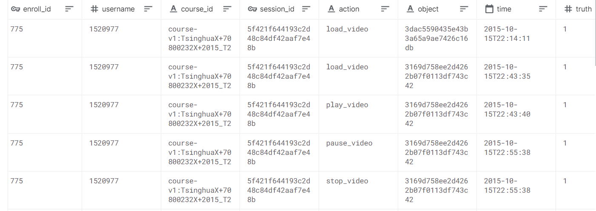

Here, ‘truth; indicates whether a student dropped out of particular course - 1 means he/she dropped out, 0 means he/she continued the course.
The ‘action’ column consists of categorical data about the activity a user does, corresponding to the timestamp value in the ‘time’ column. These
track logs have 17 unique actions that it tracks such as ‘click_about’, ‘load_video’, ‘pause_video’, etc.

[Back to Top](#table-of-contents)

### Data Manipulation and Feature Engineering
- Only **relevant fields loaded** into the pandas dataframes to use less memory space.
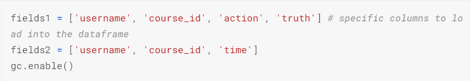 
- The ‘object’ type data in the ‘action’ column cannot be used with a machine learning model, because the algorithm doesn’t understand words like ‘click_about’ or ‘pause_video’. So pandas’ get_dummies() is used to get the dummy values from the ‘action’ column. This allows the ‘action’ column to be split into new columns, one for each unique activity  
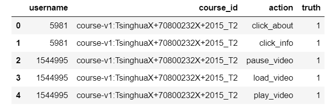  
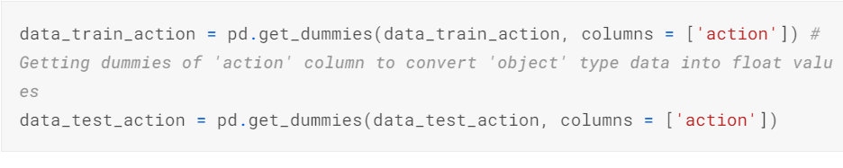
- Converted data in ‘time’ column **from ‘object’** type **into ‘datetime’ type** and **ultimately in ‘timestamp’ format**.
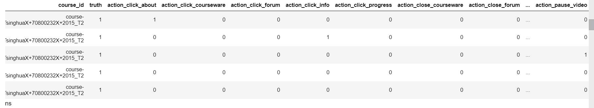  
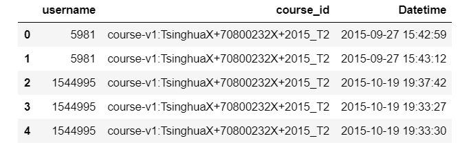  
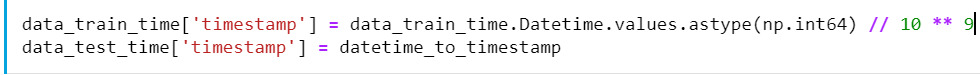
- Calculated ‘time_difference’ using pandas’ diff() to **get difference in the timestamps of consecutive activities**.
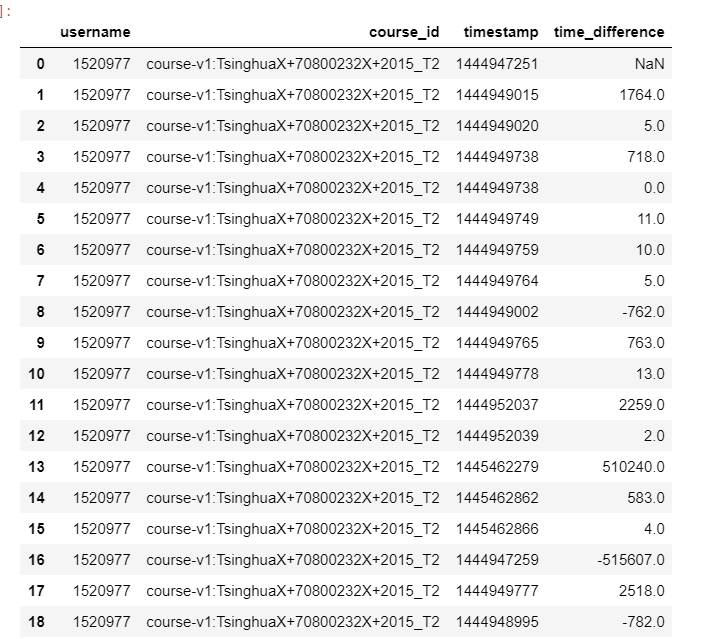
- The data **in its current format**, when passed through the algorithm, **would only give a time-based prediction** which **wouldn’t consider the activities of the user-course pairs** as independent elements. This would in turn give incomplete results. So, to address this issue, the **dataframes are groupby()-ed based on ‘username’ and ‘course_id’** so that each group in the resulting dataframe is a **unique user-course pair**.
- To make the grouped dataset more iterable, its **indices are reset.**

[Back to Top](#table-of-contents)

### Training and Testing the Model
TRAINING
- Data_train_action and data_train_time are merged. Data_test_action and data_test_time are merged.

- Data_train is split into two halves to make the training faster.
- ‘Truth’ column of data_train dataframe is set as train_labels while the other feature columns are set as train_features.
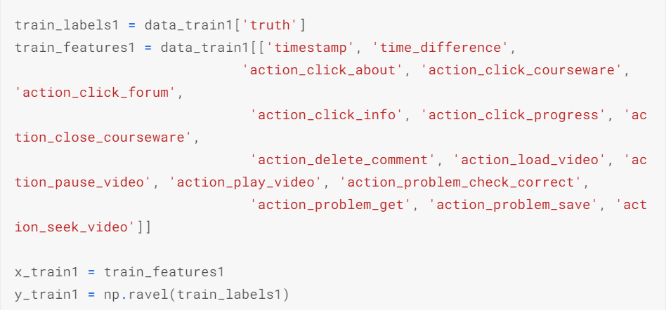
- **XGBoost’s** unique implementation of **gradient boosting decision-tree algorithm**, an approach where new models are created that **predict the residuals or errors of prior  models and then added together to make the final prediction**, allowed me to deploy a **binary classifier model** of dropout prediction **with laser-focus on memory** and **computing power efficiency**. 
- Model1 is established as an **XGBClassifier()** which is a binary classifier and given the parameter ‘gpu_hist’ that e**nables the use of Kaggle’s GPU Accelerated kernel** for **faster training**.
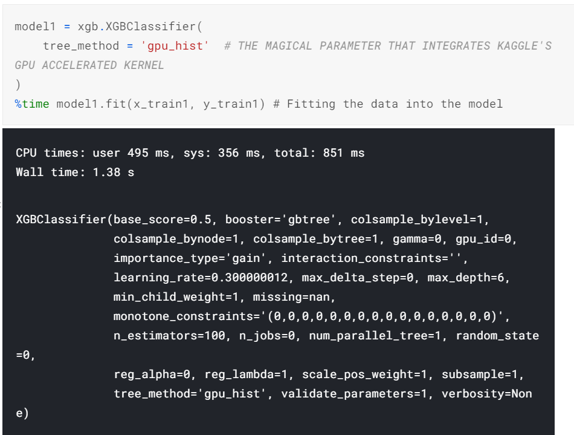    

TESTING    

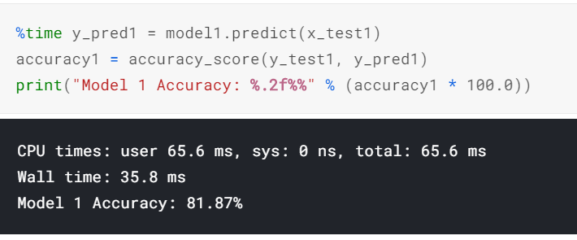

Finally, the model **obtained an accuracy of 81.87 %**,  a **considerable improvement** over the results of previous papers we cited ranging from 65 - 78 % accuracy.

[Back to Top](#table-of-contents)
